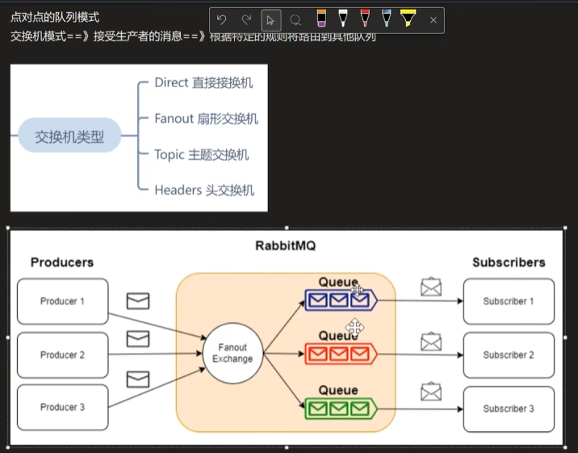
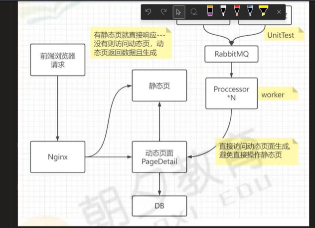
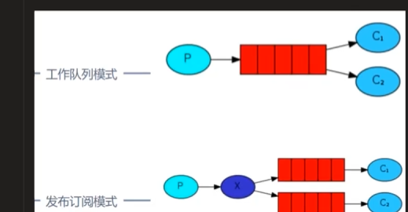

                       
// 模拟后台管理系统的请求接口

                              

使用工作队列膜式式来模拟后台管理系统的请求接口，确保每个请求都能被正确处理并返回预期的结果。通过这种方式，我们可以测试发布式消息发送功能在实际应用中的表现，并验证其正确性和可靠性。

使用MassTransit 分布式消息框架

发送强类型消息 
弄一个消息总线 发送消息
// 定义一个消息对象

生产者=单元测试项目 使用强类型消息 发送到mq
消息着=后台服务项目 staticpageworker 接收消息并处理